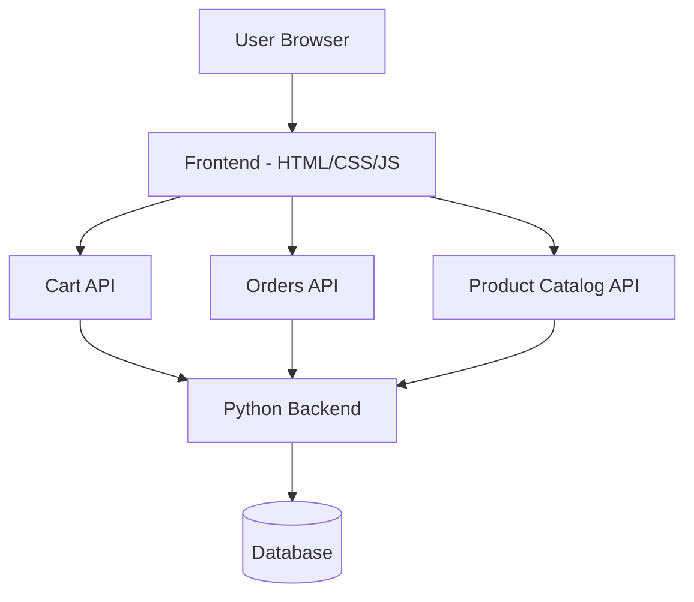

# Beyond-Infinity-Ecom

E-commerce backend for a clothing brand with a decoupled frontend/backend architecture. Implements product catalog, cart management, and orders API built with Python.

**Engineering concept:** Decoupled REST API e-commerce architecture, cart and orders API design, frontend/backend separation pattern.

## Architecture

## Tech Stack

| Layer        | Technology                   |
| ------------ | ---------------------------- |
| Backend      | Python (96%)                 |
| Frontend     | HTML/CSS (4%)                |
| Architecture | Decoupled frontend / backend |
| License      | MIT                          |

## Project Structure

├── backend/           # Python REST API  
│   ├── cart/          # Cart management endpoints  
│   ├── orders/        # Orders management endpoints  
│   └── products/      # Product catalog endpoints  
├── frontend/          # Static frontend interface  
├── .gitignore  
├── LICENSE  
└── README.md  

## API Endpoints

| Method | Endpoint      | Description           |
| ------ | ------------- | --------------------- |
| GET    | /products     | List all products     |
| GET    | /products/:id | Get single product    |
| POST   | /cart         | Add item to cart      |
| GET    | /cart         | View cart             |
| DELETE | /cart/:id     | Remove item from cart |
| POST   | /orders       | Place an order        |
| GET    | /orders/:id   | Get order status      |

## How to Run Locally

git clone https://github.com/Jagmohan-Prajapati/Beyond-Infinity-Ecom.git  
cd Beyond-Infinity-Ecom  

### Backend
cd backend  
pip install -r requirements.txt  
python app.py  

### Frontend (separate terminal)
cd frontend  

Open index.html in browser or serve with:  
python -m http.server 8080  
  
Backend API: http://localhost:5000  
Frontend: http://localhost:8080  

## Example Usage

### Add item to cart
POST /cart  
{  
  "product_id": "101",  
  "quantity": 2  
}  

### Response
{  
  "cart_id": "abc123",  
  "items": [{"product": "Black Hoodie", "qty": 2, "price": 1299}],  
  "total": 2598  
}  
